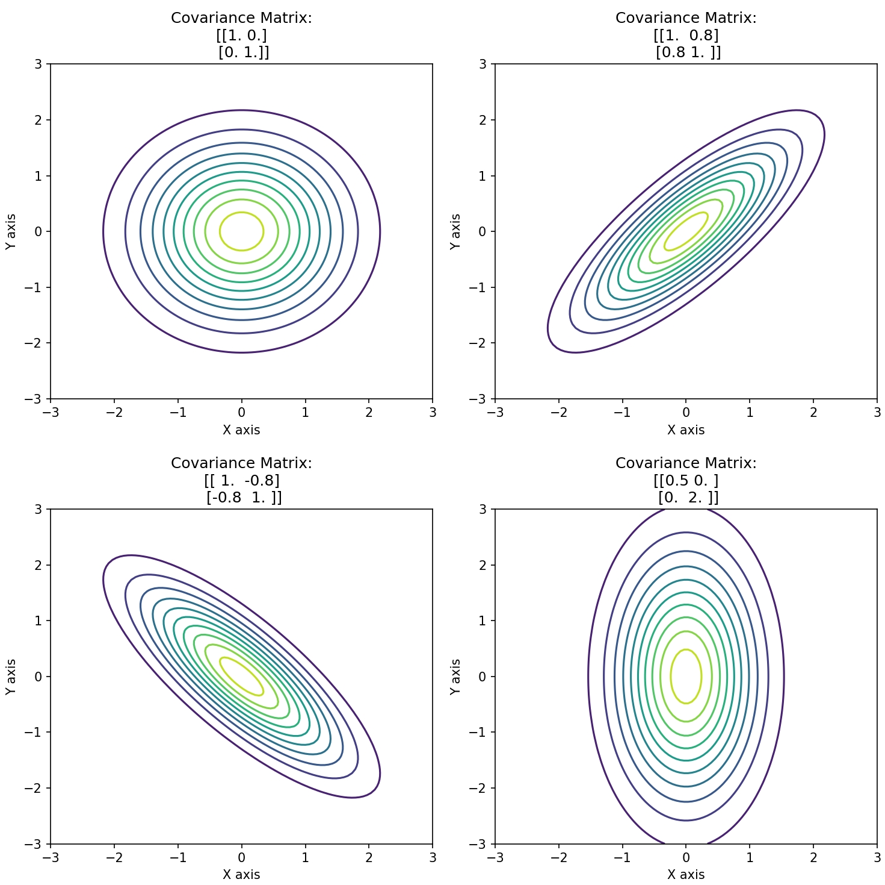
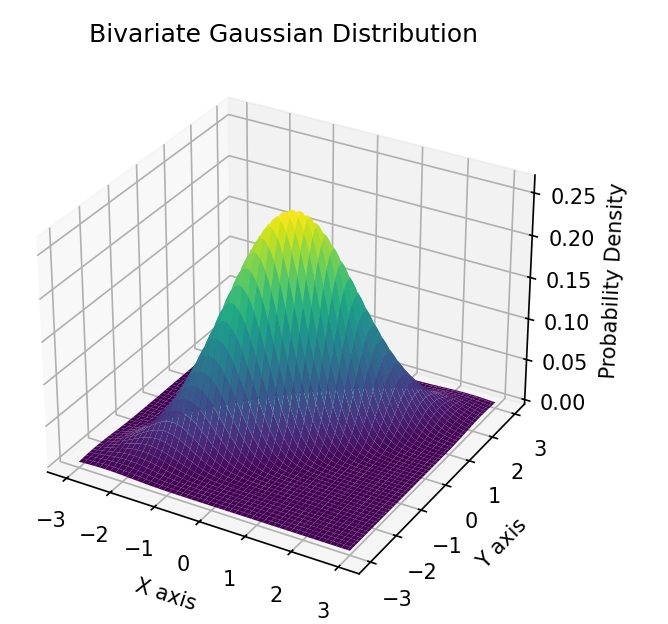

# 生成式学习算法备课稿

## 高斯判别分析的求解结果推导

关于协方差先验phi的估计值推导

$$
\begin{aligned}
& l\left(\phi, u_0, u_1, \Sigma\right)=\log \prod_{i=1}^n p\left(x^{(i)}, y^{(i)} ; \phi, u_0, u_1, \Sigma\right) \\
& \quad=\log \prod_{i=1}^n p\left(x^{(i)} \mid y(i) ; u_0, u_1, \Sigma\right) \cdot p\left(y^{(i)} ; \phi\right) \\
& \quad=\sum_{i=1}^n\left[\log p\left(x^{(i)} \mid y(i) ; u_0, u_1, \Sigma\right)+\log p\left(y^{(i)} ; \phi\right)\right] \\
& \frac{\partial l}{\partial \phi}=\frac{\partial}{\partial \phi}\left[\sum_{i=1}^n \log p\left(y^{(i)} ; \phi\right)\right] \\
& =\frac{\partial}{\partial \phi}\left\{\sum_{i=1}^n \log \left[\phi^{y(i)} \cdot(1-\phi)^{(1-y(i))}\right]\right. \\
& =\frac{\partial}{\partial \phi}\left\{\sum_{i=1}^n[y(i) \log \phi+(1-y(i)) \log (1-\phi)]\right\} \\
& =\quad \sum_{i=1}^n 1\left(y^{(i)}=1\right) \frac{1}{\phi}+\sum_{i=1}^n 1(y(i)=0) \frac{-1}{1-\phi}=0 \\
& \frac{s}{\phi}=\frac{t}{1-\phi}[s+t=n] \\
& \quad \phi=\frac{s}{s+t}=\frac{s}{n}=\frac{1}{n} \sum_{i=1}^n\left\{1\left(y^{(i)}=1\right\}\right.
\end{aligned}
$$

关于矩阵u的估计推导

$$
\begin{aligned}
& \frac{\partial l}{\partial u_0}= \frac{\partial}{\partial u_0}\left[\sum_{i=1}^n \log p\left(x^{(i)} \mid y(i) ; u_0 u_1, \Sigma\right)\right] \\
&=\left.\frac{\partial}{\partial u_0}\left[\sum_{i=1}^n 1\left(y^{(i)}\right)=0\right) \log p\left(x^{(i)} \mid y(i) ; u_0, \Sigma\right)\right] \\
&= \frac{\partial}{\partial u_0}\left(\sum_{i=1}^n 1\left(y^{(i)}=0\right) \log \frac{1}{(2 \pi)^{d / 2}|\Sigma|^{1 / 2}} \exp \left(-\frac{1}{2}\left(x^{(i)}-u_0\right)^{\top} \Sigma^{-1}\left(x^{(i)}-u_0\right)\right)\right. \\
&= \frac{\partial}{\partial u_0}\left(\sum _ { i = 1 } ^ { n } 1 ( y ^ { ( i ) } = 0 ) \operatorname { l o g } \left(\frac{1}{c}+\log \exp \left(-\frac{1}{2}\left(x^{(i)}-u_0\right) \Sigma^{\top} \Sigma^{-1}\left(x^{(i)}-u_0\right)\right)\right)\right) \\
&= \frac{\partial}{\partial u_0}\left[\sum_{i=1}^n 1\left(y^{(i)}=0\right)-\frac{1}{2}\left(x^{(i)}-u_0\right)^{\top} \Sigma^{-1}\left(x^{(i)}-u_0\right)\right] \\
&= \sum_{i=1}^n 1\left(y^{(i)}=0\right)(-\frac{1}{2} \Sigma^{-1}\left(x^{(i)}-u_0\right) \cdot(-1))=0 \\
& \therefore \quad \sum_{i=1}^n 1\left(y^{(i)}=0\right) \frac{1}{2} \Sigma^{-1}\left(x^{(i)}-u_0\right)=0 \\
& \sum_{i=1}^n 1\left(y^{(i)}=0\right)\left(x^{(i)}-u_0\right)=0 \\
& u_0= \frac{\sum_{i=1}^n 1\left(y^{(i)}=0\right) x^{(i)}}{\sum_{i=1}^n 1\left(y^{(i)}=0\right)}
\end{aligned}
$$

关于协方差sigma估计值推导

prompts:多元高斯函数的gda算法求解二分类问题中，假设协方差sigma在0，1条件下相同，如何通过概率公式得出sigma的估计，请给出具体的推导过程，特备时sigma的行列式及相关的导数计算方面的说明。

$$
\begin{aligned}
& P\left(x_i \mid y_i\right)=\frac{1}{(2 \pi)^{n / 2}|\Sigma|^{1 / 2}} \exp \left(-\frac{1}{2}\left(x_i-u_{y_i}\right)^{\top} \Sigma^{-1}\left(x_i-u_{y_i}\right)\right) \\
& \Rightarrow L\left(X, Y ; \phi, u_0, u_1, \Sigma\right)=\prod_{i=1}^m p\left(x_i \mid y_i\right) p\left(y_i\right) \\
& \Rightarrow \ell\left(X, Y ; \phi, u_0, u_1, \Sigma\right)=\sum_{i=1}^m\left[y_i \log \phi+\left(1-y_i\right) \log (1-\phi)+\log p\left(x_i \mid y_i\right)\right] \\
& \log p\left(x_i \mid y_i\right)=-\frac{n}{2} \log (2 \pi)-\frac{1}{2} \log |\Sigma|-\frac{1}{2}\left(x_i-u_{y_i}\right)^{\top} \Sigma^{-1}\left(x_i-u_{y_i}\right) \\
& l_\Sigma=\sum_{i=1}^m\left[-\frac{1}{2} \log |\Sigma|-\frac{1}{2}\left(x_i-u_{y_i})^{\top} \Sigma^{-1}\left(x_i-u_{y_i}\right)\right]\right. \\
& =-\frac{m}{2} \log |\Sigma|-\frac{1}{2} \sum_{i=1}^m\left(x_i-u_{y_i}\right)^{\top} \Sigma^{-1}\left(x_i-u_{y_i}\right) \\
& S=\sum_{i=1}^m\left(x_i-u_{y_i}\right)\left(x_i-u_{y_i}\right)^{\top} \\
& \sum_{i=1}^m\left(x_i-u_{y_i}\right)^{\top} \Sigma^{-1}\left(x_i-u_{y_i}\right)=\sum_{i=1}^m \operatorname{tr}\left(\left(x_i-u_{y_i}\right)^{\top} \Sigma^{-1}\left(x_i-u_{y_i}\right)\right)(\operatorname{tr}(A B C)=\operatorname{tr}(B C A)) \\
& =\sum_{i=1}^m \operatorname{tr}\left(\Sigma^{-1}\left(x_i-u_{y_i}\right)\left(x_i-u_{y_i}\right)^{\top}\right)=\operatorname{tr}\left(\Sigma^{-1} S\right) \\
& \therefore l_{\Sigma}=-\frac{m}{2} \log |\Sigma|-\frac{1}{2} \operatorname{tr}\left(\Sigma^{-1} s\right)
\end{aligned}
$$

关于矩阵的行列式的结果相对于矩阵的导数

$$
\begin{aligned}
& \frac{\partial|A|}{\partial A}=\left(\frac{\partial|A|}{\partial A_{i j}}\right)_{n \times n} \quad|A|=\sum_{j=1}^n A_{i j} C_{i j} \\
& C_{i j}=(-1)^{(i+j)} M_{i j} \text { ( } M_{i j} \text { 是 } A_{i j} \text { 的余子式) } \\
& \frac{\partial|A|}{\partial A_{i j}}=\frac{\partial\left(A_{i j} C_{i j}\right)}{\partial A_{i j}}=C_{i j} \\
& \operatorname{adj}(A)=\left(C_{j i}\right)_{n \times n} \quad(A \text { 的伴随矩阵 }) \\
& \frac{\partial|A|}{\partial A_{i j}}=C_{i j}=\left(\operatorname{adj}(A)^{\top}\right)_{i j} \\
& \frac{\partial|A|}{\partial A}=\operatorname{adj}(A)^{\top} \quad A^{-1}=\frac{1}{|A|} \operatorname{adj}(A) \quad(A \text { 的逆矩阵定义 }) \\
& \operatorname{adj}(A)=|A| A^{-1} \quad \therefore \frac{\partial|A|}{\partial A}=|A|\left(A^{-1}\right)^{\top}
\end{aligned}
$$

$$
\begin{aligned}
& f=\operatorname{tr}\left(\Sigma^{-1} S\right) \\
& d f=d \left[\operatorname{tr}\left(\Sigma^{-1} S\right)\right]=\operatorname{tr}\left(d\left(\Sigma^{-1} S\right)\right) \\
& d\left(\Sigma^{-1} S\right)=d \Sigma^{-1} \cdot S+\Sigma^{-1} \cdot d S=d \Sigma^{-1} S \\
& \quad \Sigma \Sigma^{-1}=1 \\
& d\left(\Sigma \Sigma^{-1}\right)=0 \\
& d \Sigma \cdot \Sigma^{-1}+\Sigma \cdot d\left(\Sigma^{-1}\right)=0 \\
& \quad d\left(\Sigma^{-1}\right)=-\Sigma^{-1} \cdot d \Sigma \cdot \Sigma^{-1} \\
& \operatorname{tr}\left(d\left(\Sigma^{-1} S\right)=\operatorname{tr}\left(d \Sigma^{-1} \cdot S\right)=\operatorname{tr}\left(-\Sigma^{-1} \cdot d \Sigma \cdot \Sigma^{-1} \cdot S\right)\right. \\
& \quad=\operatorname{tr}\left(-\Sigma^{-1} \cdot S \cdot \Sigma^{-1} \cdot d \Sigma\right)=d f
\end{aligned}
$$

$$
\begin{aligned}
& d f=\operatorname{tr}\left(G^{\top} d \Sigma\right) \\
& \frac{d f}{d \Sigma}=G \quad(\text { 根据迹的定义可以展开证明 }) \\
& \operatorname{tr}\left(-\Sigma^{-1} \cdot S \cdot \Sigma^{-1} \cdot d \Sigma\right)=d f \\
& \quad \begin{aligned}
G^{\top} & =-\Sigma^{-1} S \Sigma^{-1} \\
G & =\left(-\Sigma^{-1} S \Sigma^{-1}\right)^{\top}=-\left(\Sigma^{-1} S \cdot \Sigma^{-1}\right)^{\top} \\
& =-\left(\Sigma^{-1}\right)^{\top}\left(\Sigma^{-1} S\right)^{\top} \\
& =-\Sigma^{-1} S^{\top} \Sigma^{-1}=-\Sigma^{-1} S \Sigma^{-1}
\end{aligned} \\
& \begin{aligned}
\frac{\partial l_ \Sigma}{\partial \Sigma} & =-\frac{m}{2} \Sigma^{-1}+\frac{1}{2} \Sigma^{-1} \cdot S \Sigma^{-1}=0 \\
& \Rightarrow \Sigma=\frac{1}{m} S=\frac{1}{m} \sum_{i=1}^m\left(x_i-u_{y_i}\right)\left(x_i-u_{y_i}\right)^{\top}
\end{aligned}
\end{aligned}
$$

$$
\begin{aligned}
& d f=\operatorname{tr}\left(G^{\top} d \Sigma\right) \\
& G^{\top} d \Sigma=\left[\begin{array}{cccc}
G_{11} & G_{21} & \cdots & G_{n 1} \\
G_{12} & G_{22} & \cdots & G_{n 2} \\
G_{1 n} & G_{22} & \cdots & G_{n n}
\end{array}\right]\left[\begin{array}{cccc}
d \Sigma_{11} & d \Sigma_{12} & \ldots & d \Sigma_{n 1} \\
d \Sigma_{21} & d \Sigma_{22} & \ldots & d \Sigma_{n 2} \\
\vdots & \vdots & & \\
d \Sigma_{m 1} & d \Sigma_{m 2} & \ldots & d \Sigma_{n n}
\end{array}\right] \\
& \frac{d f}{d \Sigma}=\frac{d \operatorname{tr}\left(G^{\top} d \Sigma\right)}{d \Sigma} \quad \frac{d f}{d \Sigma_{i j}}=\frac{\operatorname{tr}\left(G^{\top} d \Sigma\right)}{d \Sigma_{i j}}=\frac{G_{i j} d \Sigma_{i j}}{d \Sigma_{i j}}=G_{i j} \\
& \therefore \frac{d f}{d \Sigma}=G
\end{aligned}
$$

## 关于多元高斯概率分布的可视化展示部分

- 等高线图

