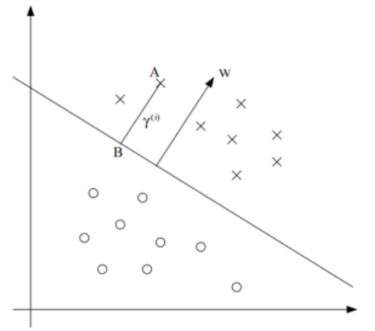

# 支持向量机

## 几何间隔定义的推导

  

- 如图所示直线上方的几何距离的计算公式如下（此时y(i)=1，下方的原点类似，统一成最后一行公式）

$$
\begin{array}{r}
w^{\top}\left(x^{(i)}-\frac{w}{\|w\|} \gamma ^{(i)}\right)+b=0 \\
w^{\top} x^{(i)}-\frac{w^{\top} w}{\|w\|} \gamma^{(i)}+b=0 \\
w^{\top} x^{(i)}+b=\frac{w^{\top} w}{\|w\|} \gamma^{(i)} \\
\gamma^{(i)}=\frac{w^{\top} x^{(i)}+b}{\|w\|} \\
=\frac{w^{\top} x^{(i)}}{\|w\|}+\frac{b}{\|w\|} \\
\gamma^{(i)}=y^{(i)}\left(\left(\frac{w}{\| w \|}\right)^{\top} x^{(i)}+\frac{b}{\|w\|}\right)
\end{array}
$$

## prompts
- 请给出广义拉格朗日函数在不等式约束函数边界核内部约束时函数取得极值的可视化示意图并加以说明。

## 实验部分准备
- 决策边界的可视化
- jupyter notebook文件的执行和解释