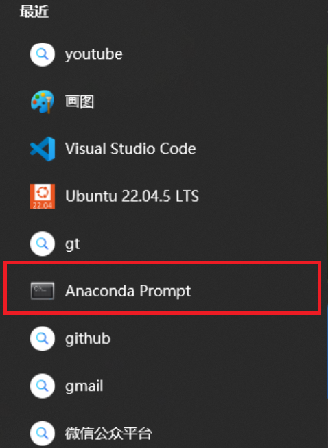
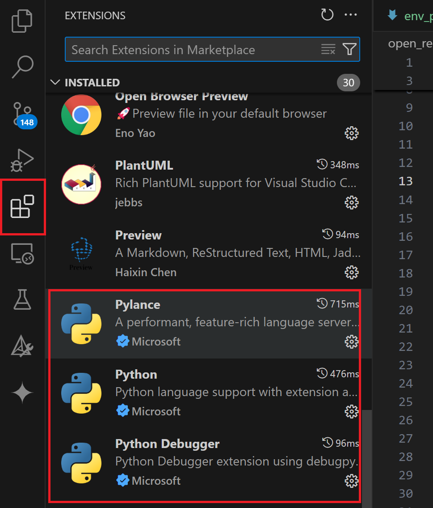
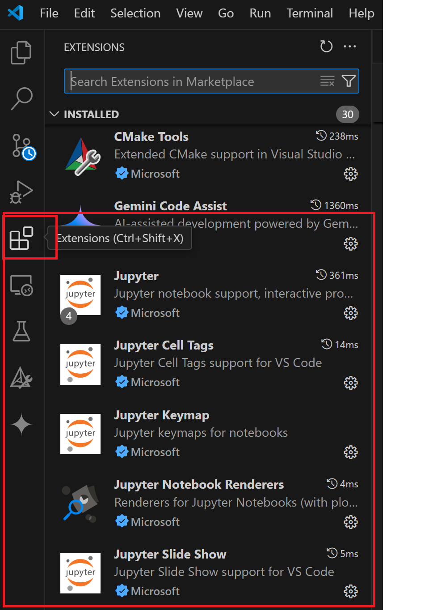

# python编程环境准备

## miniconda

- 下载链接：

https://repo.anaconda.com/miniconda/Miniconda3-latest-Windows-x86_64.exe

下载后双击安装后从启动窗口中选择`Anaconda Prompt`启动终端，以便进行虚拟环境的安装

###  conda基本使用
- 启动anaconda终端



- 创建隔离的开发环境
```
conda create --name python310 python=3.10
```

中间有个提示输入y确认后即可，输出如下：

```
Retrieving notices: ...working... done
Channels:
 - defaults
Platform: win-64
Collecting package metadata (repodata.json): done
Solving environment: done

## Package Plan ##

  environment location: E:\Programs\Anaconda\envs\python310

  added / updated specs:
    - python=3.10

The following packages will be downloaded:

    package                    |            build
    ---------------------------|-----------------
    bzip2-1.0.8                |       h2bbff1b_6          90 KB
    ca-certificates-2025.2.25  |       haa95532_0         130 KB
    libffi-3.4.4               |       hd77b12b_1         122 KB
    openssl-3.0.16             |       h3f729d1_0         7.8 MB
    pip-25.1                   |     pyhc872135_2         1.3 MB
    python-3.10.16             |       h4607a30_1        16.3 MB
    setuptools-78.1.1          |  py310haa95532_0         1.7 MB
    sqlite-3.45.3              |       h2bbff1b_0         973 KB
    tk-8.6.14                  |       h5e9d12e_1         3.5 MB
    tzdata-2025b               |       h04d1e81_0         116 KB
    vc-14.42                   |       haa95532_5          11 KB
    vs2015_runtime-14.42.34433 |       hbfb602d_5         1.2 MB
    wheel-0.45.1               |  py310haa95532_0         145 KB
    xz-5.6.4                   |       h4754444_1         280 KB
    zlib-1.2.13                |       h8cc25b3_1         131 KB
    ------------------------------------------------------------
                                           Total:        33.7 MB

The following NEW packages will be INSTALLED:

  bzip2              pkgs/main/win-64::bzip2-1.0.8-h2bbff1b_6
  ca-certificates    pkgs/main/win-64::ca-certificates-2025.2.25-haa95532_0
  libffi             pkgs/main/win-64::libffi-3.4.4-hd77b12b_1
  openssl            pkgs/main/win-64::openssl-3.0.16-h3f729d1_0
  pip                pkgs/main/noarch::pip-25.1-pyhc872135_2
  python             pkgs/main/win-64::python-3.10.16-h4607a30_1
done
#
# To activate this environment, use
#
#     $ conda activate python310
#
# To deactivate an active environment, use
#
#     $ conda deactivate
```

然后激活环境:

```
activate python310
```

安装`ipykernel`以便在jupyter notebook中交互式运行python代码。

```
python -m pip install ipykernel
```

输入如下的命令退回到`base`环境：

```
conda deactivate
```


## vscode

下载安装： https://code.visualstudio.com/

安装插件： python，jupyter，安装的方法在下图的搜索框中分别先后输入python，jupyter。并进行相关插件的安装。

安装完成后显示:





## 补充资源

- https://mirrors.tuna.tsinghua.edu.cn/anaconda/archive/
- https://repo.anaconda.com/miniconda/


